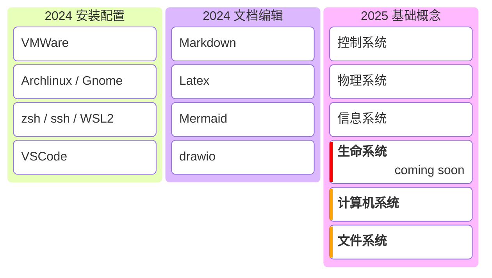

# Linux 的细节

本项目地址：

> https://github.com/StevenBaby/linux_detail

## 项目规划及进度

## 安装配置
- VMWare:
    - [x] 显示缩放比例
    - [x] 快照和挂起
    - [ ] CPU 虚拟化模式
    - [ ] UEFI
    - [x] open-vm-tools [^vm-tools]
    - [x] gtkmm3
- 镜像地址：
    - [x] [北京外国语大学镜像站](https://mirrors.bfsu.edu.cn/archlinux/) [^bfsu_mirrors]
- grub:
    - [x] 启动超时修改
- gnome:
    - [x] gnome
    - [x] gdm
    - [x] gnome-tweaks
    - [x] gnome-terminal
    - [x] gnome-console
    - [x] nautilus
    - [ ] xorg
    - [x] keyboard shortcut
        - [x] gnome-terminal
        - [x] nautilus
    - [x] font size
    - [x] display scale
    - [x] firefox
    - [x] ttf-fira-code
    - [x] wqy-zenhei
    - [x] extensions
    - [x] GNOME Shell integration
    - [x] gnome-browser-connector
    - [x] Input Method Panel
    - [x] fcitx5
    - [x] fcitx5-chinese-addons
    - [x] fcitx5-configtool
- ssh：
    - [x] 免密登录
    - [ ] RSA原理
    - [ ] 椭圆曲线密码学
- pacman
- flathub
- sudo
- zsh
    - [x] zsh
    - [x] oh-my-zsh
    - [x] powerlevel10k
- [ ] Windows Terminal [^windows-terminal]
- [ ] Windows Subsystem for Linux

## 开发工具

- autogen [^autogen]
    - [ ] autoopts
- cflow [^cflow]
- doxygen [^doxygen]
    - graphviz
    - qt6-base
- syslog[^syslog]
- bind9 [^bind9]
    - libisc
- gtk
- gtkmm3

## References

[^bfsu_mirrors]: https://mirrors.bfsu.edu.cn/archlinux/
[^windows-terminal]: https://github.com/microsoft/terminal
[^vm-tools]: https://wiki.archlinux.org/title/VMware/Install_Arch_Linux_as_a_guest
[^cflow]: https://www.gnu.org/software/cflow/
[^doxygen]: https://www.doxygen.nl/
[^autogen]: https://www.gnu.org/software/autogen/
[^syslog]: https://www.man7.org/linux/man-pages/man3/syslog.3.html
[^bind]: https://gitlab.isc.org/isc-projects/bind9
