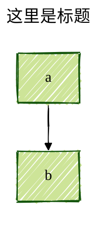
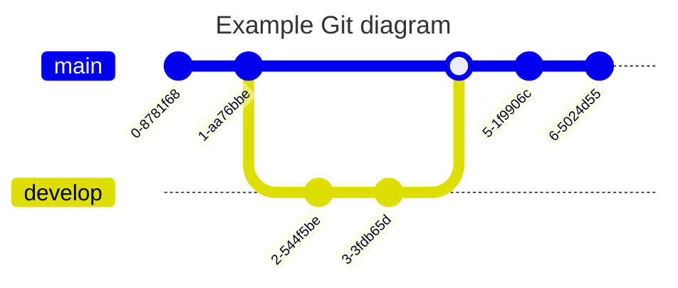

# Mermaid 流程图

> Mermaid [^mermaid] is JavaScript based diagramming and charting tool that renders Markdown-inspired text definitions to create and modify diagrams dynamically.
> 
> Mermaid 是基于 JavaScript 的流程图和图表工具，可以动态地渲染受 Markdown 启发的文本定义的流程图。

---

- 插件：Markdown Preview Mermaid Support [^plugin]
- Markdown All in One: Toggle code block： ALT + F

---

Mermaid 的流程图语法在 [^mermaid-syntax]，其中包括了：

- 结点
- 流程图方向
- 结点形状
- 结点连接线
- 连接线箭头
- 子流程图
- 结点样式

## 流程图

### 结点


### 流程图方向

方向包括：

- 从上到下： TB - Top to bottom
- 从上到下： TD - Top-down
- 从下到上： BT - Bottom to top
- 从右到左： RL - Right to left
- 从左到右： LR - Left to right


### 结点形状


### 结点连接线


### 配置项

默认包括一下几种主题 [^theme]：

- default - This is the default theme for all diagrams.
- neutral - This theme is great for black and white documents that will be printed.
- dark - This theme goes well with dark-colored elements or dark-mode.
- forest - This theme contains shades of green.
- base - This is the only theme that can be modified. Use this theme as the base for customizations.

用法如下：



## 其他类型

Mermaid 还有很多其他类型的图表，比如：

### 时序图(Sequence Diagram)

时序图 [^sequence] 用于描述实体之间发送消息的时序关系；


### 类图(Class Diagram)

在软件工程中，统一建模语言（UML）中的类图 [^class] 是一类静态结构图，它通过显示系统的类、它们的属性、操作（或方法）以及对象之间的关系来描述系统的结构。


### 状态转移图(State Diagram)

状态转移图(State Diagram) [^state] 是计算机科学及相关领域用来描述系统行为的一种图。状态图要求所描述的系统由有限个状态组成；描述状态及其转移，比如有限状态机，马尔可夫状态转移图等；


### 实例关系图(Entity Relationship Diagram)

实体关系模型 [^er] （或ER模型） 描述特定知识领域中感兴趣的相关事物。基本的ER模型由实体类型（对感兴趣的事物进行分类）组成，并指定实体之间可能存在的关系（这些实体类型的实例）。


### 用户旅程图(User Journey) 

用户旅程图 [^journey] 详细地描述了不同用户在系统、应用程序或网站中完成特定任务时采取的步骤。此技术显示当前用户工作流，并显示将来工作流的改进区域。


### 甘特图(Gantt) 

甘特图 [^gantt] 是一种条形图，由 Karol Adamiecki 在 1896 年首次提出，亨利·甘特（Henry Gantt）在 1910 年代独立提出，用来说明项目进度和完成任何一个项目所需的时间。甘特图说明项目的终端元素和汇总元素的开始和结束日期之间的天数。


### 饼图(Pie Chart)

饼图 [^pie] 是一种圆形统计图形，它被划分为多个切片，以说明数字比例。在饼图中，每个切片的弧长（以及中心角和面积）与它所代表的数量成正比。虽然它的名字源于它与被切成薄片的馅饼的相似之处，但它的呈现方式却有很多变化。人们所知的最早的饼状图通常要归功于1801年威廉·普莱费尔的《统计学摘要》


### 象限图(Quadrant Chart) 

象限图 [^quadrant] 被划分为四个象限的数据的可视化表示。它用于在二维网格上绘制数据点，一个变量表示x轴，另一个变量表示y轴。根据一组特定于所分析数据的标准，将图表分成四个相等的部分，从而确定象限。象限图通常用于识别数据中的模式和趋势，并根据图表中数据点的位置来确定行动的优先级。它们通常用于商业、市场营销和风险管理等领域。


### 需求图(Requirement Diagram) 

需求图 [^requirement] 为需求及其相互之间和其他文档化元素之间的联系提供了可视化。建模规范遵循 SysML v1.6 定义的规范。


### Git 

Git图 [^git] 是不同分支上 Git 提交和Git操作（命令）的图形表示。



### C4 图(C4 Diagram) 

C4-PlantUML [^c4] [^c4-plantuml] 结合了 PlantUML 和 C4 模型的优点，使用开源和平台无关工具的直观语言提供了一种描述和通信软件体系结构的简单方法，特别是在预先设计阶段。


### 思维导图(Mindmaps)

思维导图 [^mind] 用于可视化地将信息组织成层次结构，显示整体各个部分之间的关系。它通常是围绕一个单一的概念创建的，在空白页的中心以图像的形式绘制，并在其上添加相关的概念表示，如图像、单词和单词的部分。主要思想与中心概念直接相连，而其他思想则是从这些主要思想衍生出来的


### 时间线(Timeline)

时间线  [^timeline] 用于说明事件、日期或时间段的年表。它通常以图形的方式表示时间的流逝，并且通常按时间顺序组织。基本的时间轴按时间顺序呈现一系列事件，通常使用日期作为标记。时间轴还可以用来显示事件之间的关系，例如一个人生活中事件之间的关系。


### ZenUML

ZenUML [^zen] 是序列图的另一种渲染方式；


### 桑基图(Sankey)

桑基图 [^sanky] 是一种可视化的图表，用于描述从一组值到另一组值的流动。

```mermaid
---
config:
  sankey:
    showValues: false
---
sankey-beta

Agricultural 'waste',Bio-conversion,124.729
Bio-conversion,Liquid,0.597
Bio-conversion,Losses,26.862
Bio-conversion,Solid,280.322
Bio-conversion,Gas,81.144
Biofuel imports,Liquid,35
Biomass imports,Solid,35
Coal imports,Coal,11.606
Coal reserves,Coal,63.965
Coal,Solid,75.571
District heating,Industry,10.639
District heating,Heating and cooling - commercial,22.505
District heating,Heating and cooling - homes,46.184
Electricity grid,Over generation / exports,104.453
Electricity grid,Heating and cooling - homes,113.726
Electricity grid,H2 conversion,27.14
Electricity grid,Industry,342.165
Electricity grid,Road transport,37.797
Electricity grid,Agriculture,4.412
Electricity grid,Heating and cooling - commercial,40.858
Electricity grid,Losses,56.691
Electricity grid,Rail transport,7.863
Electricity grid,Lighting & appliances - commercial,90.008
Electricity grid,Lighting & appliances - homes,93.494
Gas imports,Ngas,40.719
Gas reserves,Ngas,82.233
Gas,Heating and cooling - commercial,0.129
Gas,Losses,1.401
Gas,Thermal generation,151.891
Gas,Agriculture,2.096
Gas,Industry,48.58
Geothermal,Electricity grid,7.013
H2 conversion,H2,20.897
H2 conversion,Losses,6.242
H2,Road transport,20.897
Hydro,Electricity grid,6.995
Liquid,Industry,121.066
Liquid,International shipping,128.69
Liquid,Road transport,135.835
Liquid,Domestic aviation,14.458
Liquid,International aviation,206.267
Liquid,Agriculture,3.64
Liquid,National navigation,33.218
Liquid,Rail transport,4.413
Marine algae,Bio-conversion,4.375
Ngas,Gas,122.952
Nuclear,Thermal generation,839.978
Oil imports,Oil,504.287
Oil reserves,Oil,107.703
Oil,Liquid,611.99
Other waste,Solid,56.587
Other waste,Bio-conversion,77.81
Pumped heat,Heating and cooling - homes,193.026
Pumped heat,Heating and cooling - commercial,70.672
Solar PV,Electricity grid,59.901
Solar Thermal,Heating and cooling - homes,19.263
Solar,Solar Thermal,19.263
Solar,Solar PV,59.901
Solid,Agriculture,0.882
Solid,Thermal generation,400.12
Solid,Industry,46.477
Thermal generation,Electricity grid,525.531
Thermal generation,Losses,787.129
Thermal generation,District heating,79.329
Tidal,Electricity grid,9.452
UK land based bioenergy,Bio-conversion,182.01
Wave,Electricity grid,19.013
Wind,Electricity grid,289.366
```

### XY 图(XY Chart) 

XY图表 [^xy] 是一个全面的图表模块，包括利用x轴和y轴进行数据表示的各种类型的图表。目前，它包括两种基本的图表类型：条形图和折线图。这些图表旨在可视化地显示和分析涉及两个数值变量的数据。

```mermaid
xychart-beta
    title "Sales Revenue"
    x-axis [jan, feb, mar, apr, may, jun, jul, aug, sep, oct, nov, dec]
    y-axis "Revenue (in $)" 4000 --> 11000
    bar [5000, 6000, 7500, 8200, 9500, 10500, 11000, 10200, 9200, 8500, 7000, 6000]
    line [5000, 6000, 7500, 8200, 9500, 10500, 11000, 10200, 9200, 8500, 7000, 6000]
```

### 框图(Block Diagram)

框图 [^block] 是一种直观而有效的方法，可以可视化地表示复杂的系统、过程或体系结构。

```mermaid
block-beta
columns 1
  db(("DB"))
  blockArrowId6<["&nbsp;&nbsp;&nbsp;"]>(down)
  block:ID
    A
    B["A wide one in the middle"]
    C
  end
  space
  D
  ID --> D
  C --> D
  style B fill:#969,stroke:#333,stroke-width:4px
```

### 数据包(Packet)

数据包图 [^packet] 是一种可视化表示，用于说明网络包的结构和内容。网络分组是在网络上传输数据的基本单位。

```mermaid
---
title: "TCP Packet"
---
packet-beta
0-15: "Source Port"
16-31: "Destination Port"
32-63: "Sequence Number"
64-95: "Acknowledgment Number"
96-99: "Data Offset"
100-105: "Reserved"
106: "URG"
107: "ACK"
108: "PSH"
109: "RST"
110: "SYN"
111: "FIN"
112-127: "Window"
128-143: "Checksum"
144-159: "Urgent Pointer"
160-191: "(Options and Padding)"
192-255: "Data (variable length)"
```

### 看板(Kanban) 

看板图 [^kanban] 允许你创建工作流不同阶段中任务移动的可视化表示。

```mermaid
---
config:
  kanban:
    ticketBaseUrl: 'https://mermaidchart.atlassian.net/browse/#TICKET#'
---
kanban
  Todo
    [Create Documentation]
    docs[Create Blog about the new diagram]
  [In progress]
    id6[Create renderer so that it works in all cases. We also add som extra text here for testing purposes. And some more just for the extra flare.]
  id9[Ready for deploy]
    id8[Design grammar]@{ assigned: 'knsv' }
  id10[Ready for test]
    id4[Create parsing tests]@{ ticket: MC-2038, assigned: 'K.Sveidqvist', priority: 'High' }
    id66[last item]@{ priority: 'Very Low', assigned: 'knsv' }
  id11[Done]
    id5[define getData]
    id2[Title of diagram is more than 100 chars when user duplicates diagram with 100 char]@{ ticket: MC-2036, priority: 'Very High'}
    id3[Update DB function]@{ ticket: MC-2037, assigned: knsv, priority: 'High' }

  id12[Can't reproduce]
    id3[Weird flickering in Firefox]
```

### 架构图(Architecture) 

架构图 [^architecture] 用于显示云或CI/CD部署中常见的服务和资源之间的关系。在架构图中，服务（节点）通过边连接。相关的服务可以放在组中，以更好地说明它们是如何组织的。

```mermaid
architecture-beta
    group api(cloud)[API]

    service db(database)[Database] in api
    service disk1(disk)[Storage] in api
    service disk2(disk)[Storage] in api
    service server(server)[Server] in api

    db:L -- R:server
    disk1:T -- B:server
    disk2:T -- B:db
```

## References

[^mermaid]: https://mermaid.js.org/
[^mermaid-syntax]: https://mermaid.js.org/syntax/flowchart.html
[^sequence]: https://mermaid.js.org/syntax/sequenceDiagram.html
[^class]: https://mermaid.js.org/syntax/classDiagram.html
[^state]: https://mermaid.js.org/syntax/stateDiagram.html
[^er]: https://mermaid.js.org/syntax/entityRelationshipDiagram.html
[^journey]: https://mermaid.js.org/syntax/userJourney.html
[^gantt]: https://mermaid.js.org/syntax/gantt.html
[^pie]: https://mermaid.js.org/syntax/pie.html
[^quadrant]: https://mermaid.js.org/syntax/quadrantChart.html
[^requirement]: https://mermaid.js.org/syntax/requirementDiagram.html
[^git]: https://mermaid.js.org/syntax/gitgraph.html
[^c4]: https://mermaid.js.org/syntax/c4.html
[^mind]: https://mermaid.js.org/syntax/mindmap.html
[^timeline]: https://mermaid.js.org/syntax/timeline.html
[^zen]: https://mermaid.js.org/syntax/zenuml.html
[^sanky]: https://mermaid.js.org/syntax/sankey.html
[^xy]: https://mermaid.js.org/syntax/xyChart.html
[^block]: https://mermaid.js.org/syntax/block.html
[^packet]: https://mermaid.js.org/syntax/packet.html
[^kanban]: https://mermaid.js.org/syntax/kanban.html
[^architecture]: https://mermaid.js.org/syntax/architecture.html
[^c4-plantuml]: https://github.com/plantuml-stdlib/C4-PlantUML
[^theme]: https://mermaid.js.org/config/theming.html
[^plugin]: https://marketplace.visualstudio.com/items?itemName=bierner.markdown-mermaid