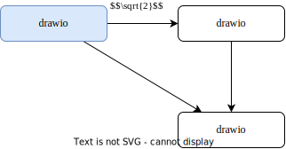

# 文档编辑小结

- Markdown
- Latex
- Mermaid
- Drawio

## drawio 流程图

- 插件：Draw.io Integration [^plugin]

Drawio [^drawio] 是一个可配置的图表/白板可视化应用程序，可以在线 [^online] 或者离线编辑流程图，流程图可以导出为 svg 或 pdf 等矢量图。

一般而言我更喜欢导入 svg，如果 svg 导入有问题，可以尝试转换程 png，但 png 是位图，所以无法保证清晰度。

## References

[^plugin]: https://marketplace.visualstudio.com/items?itemName=hediet.vscode-drawio
[^drawio]: https://github.com/jgraph/drawio
[^online]: https://app.diagrams.net/
