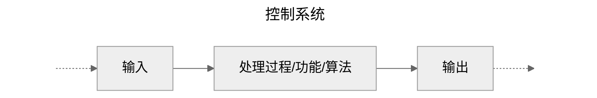
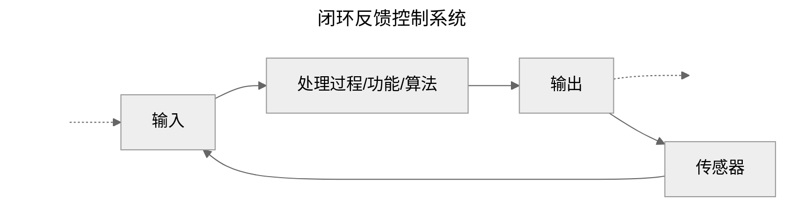

# 控制系统

## 函数

在小学二年级的时候，我们就听说过函数的概念，它通常被表示为 $y=f(x)$ 的形式：

$$
y = f(x)
$$

这里 $x$ 表示自变量，$y$ 表示应变量，$f$ 表示函数，是 function 的首字母，表示根据 $x$ 得到 $y$ 的方式，或者你可以称其为算法、功能。

通常情况下，对于特定的函数还会研究其定义域 $X$ 和值域 $Y$，分别表示 $x$ 和 $y$ 所有可能取值的集合，或者简单一点 $x$ 和 $y$ 的取值范围，于是函数又有另一种表达方式：

$$X \mapsto Y$$

表示集合 $X$ 到 集合 $Y$ 的映射，表示 $x \in X$ 可以以某种方式找到对应的 $y \in Y$。

虽然 $y$ 和 $f(x)$ 二者是相等的，这里有一些微妙的差距需要明确一下，比如假设：

$$f(x) \equiv 1 + 2 + 3 + 4 + 5 = \sum_{i = 1}^5i$$

这是一个和，而 $y \equiv 15$ 是一个数，我们很难称其为和，$y$ 是一个简单的结果，而 $f(x)$ 包含了从 $x$ 得到 $y$ 的过程，有更丰富的信息。

函数是一个抽象的概念，但是由于我们在小学二年级就已经听说了，于是是一个很好的切入点。函数的 $x$ 和 $y$ 通常是数，现在我们将其推广一下，我们可以允许 $x$ 和 $y$ 是任何事物，尽管这样推广在数学上是危险的，但是，这种类比比较直观。这样我们就可以用 $y = f(x)$ 表示从输入 $x$ 得到 输出 $y$ 的一个系统。

如果你学过机器学习，$\textbf{x} \in X$ 是特征，$\textbf{y} \in Y$ 是标注，这里我将 $\textbf{x}$ 和 $\textbf{y}$ 加粗了，表示向量，可以理解为一堆数的组合。机器学习分类算法，通常利用一系列向量（特征）和矩阵（权重）乘积的组合，得到标注的概率。

## 算法

> In mathematics and computer science, an **algorithm** is a finite sequence of mathematically rigorous instructions, typically used to solve a class of specific problems or to perform a computation. [^algorithm]
> 
> 在数学和计算机科学中，**算法**是数学上严格的有限指令序列，通常用于解决一类特定问题或执行计算。

这样，对于所有的事情处理起来我们都只需要关心输入，输出，和处理方式，之所以分成三部分的原因是：

- 输入：是我们无法控制的，是来自于外部的，不可预知；
- 算法：处理方式是我们可以控制的，也是显著最关键的部分；
- 输出：是外部希望得到的结果，尽管是我们一手操办的，但可能也与我们无关；

如果你学过数据结构，数据结构和算法经常同时出现，数据结构用来描述输入和输出，算法作用于数据结构，描述了从输入得到输出的全部细节。

一般情况下，在设计阶段，数据结构要比算法重要的多；如果你觉得自己写的代码又臭又长，大多数情况下是数据结构设计的不好。当然，很多时候数据结构不是我们能够左右的，系统已经稳定运行了一段时间，需要更新和升级，这时候我们能做的只是对确定的输入和输出之间设计算法，这种设计往往比较被动。

## 系统

> 系统是能够在一起协同工作并利用输入生产输出的 **所有组件的集合** [^system]；

大致上可以以下面的方式表示：

我们首先获得外界的原料输入 $x$，然后将其利用 $f$ 描述的方法进行加工得到 $f(x)$，为了简单起见，加工的结果是 $y$。

> 一个无法根据实际发生的情况来动态调整输入的系统是一个**开环控制系统**。

典型的开环控制系统的例子，比如基本初等函数，只读存储器，或者组合逻辑电路，对于相同的输入给出的输出是相同的。

然而，现实世界中的系统往往是不同的，系统接收到同样的输入可能得到完全不同的输出结果。

> 可以根据发生的实际情况动态调整输入的系统是一个**闭环控制系统**。

大致上可以以下面的方式表示：

与开环控制系统不同的是，闭环控制系统存在传感器，能够观测输出的内容，来调整输入。

典型的闭环控制系统的例子，比如 RS触发器，循环神经网络，带状态的函数，当然，带状态的函数在计算机中通常称为**闭包**，当然还有自动反馈控制器。

人们公认的最早应用于工业过程的自动反馈控制器，是瓦特于 1769 年发明的飞球调节器，用来控制蒸汽机的转速。

## References

[^system]: 理查德 C.多尔夫 - 现代控制系统
[^algorithm]: https://en.wikipedia.org/wiki/Algorithm
