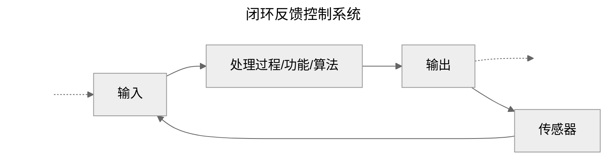
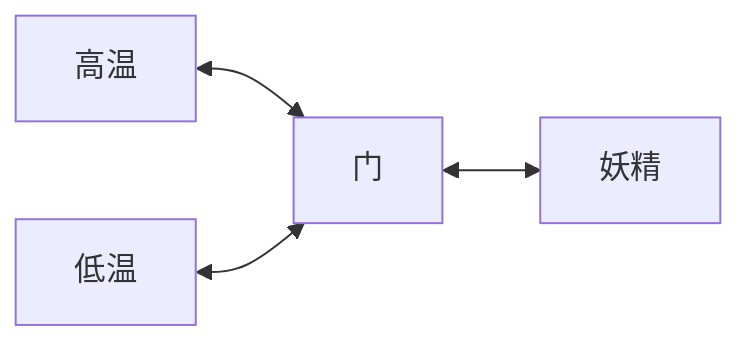

# 物理系统

- [物理系统](#物理系统)
  - [起因](#起因)
  - [热力学第一定律](#热力学第一定律)
  - [热力学第二定律](#热力学第二定律)
  - [麦克斯韦妖](#麦克斯韦妖)
  - [References](#references)

Hello 大家好，上个视频主要解释了系统设计比较抽象的概念，有兴趣的话大家可以参考《现代控制系统》，里面有更丰富的细节。不过这里就不过多赘述了，我在 [README](../../README.md#项目规划及进度) 里写了项目规划及进度，大概描绘了项目后期的发展方向。本来第三部分应该从计算机系统说起，这样看起来更合理，不过根据我自己的经验，还有一些更加本质的问题，需要回答。也就是为什么要这样设计的问题？答案是计算机系统以外也同样适用的一般结论。所以需要再多做一些解释。

本来控制系统，物理系统，信息系统和生命系统应该合成一个视频，但是后来发现，我自己能力有限，所以还是拆分一下，应该会有大量不合理的地方，这里有很多不够成熟的想法，说出来仅供参考。

上一个视频我们最后简单描述了一下，闭环控制系统和瓦特的蒸汽机，蒸汽机引发工业革命的介绍。历史上有相当多的例子，我们放在我对历史的思考里再做说明。

## 起因



上一个视频，有个很重要的结论，就是我们要尽可能的把复杂系统分成三部分：

- 输入：是我们无法控制的，是来自于外部的，不可预知；
- 系统（算法）：处理方式是我们可以控制的，也是显著最关键的部分；
- 输出：是外部希望得到的结果，尽管是我们一手操办的，但可能也与我们无关；

尽管系统是我们可以完全控制的，也是我们最主要关注的内容。但是，大多数系统的错误都是由于输入不合法造成的。那么这个视频《物理系统》，我们主要来讨论一下系统输入的内容。

和函数的概念一致，这里我们无法讨论输入具体的值，而只能讨论输入的取值范围，也就是临界值。不过现实世界的系统，我们往往很难确定临界值，所以退而求其次，我们如果可以知道输入的**超集**也可以。这样我们才能更加有效的保证系统能够稳定运行。显然知道输入的子集是不行的，因为有很多超过自己范围的输入，会导致系统奔溃。考虑到我的观众大多数与计算机相关，那么一个显而易见的事实是：写业务代码的主要工作是防止 **2B青年(攻击者)** 在数字框里输入 ABCD。

> 写代码最首先要解决的是判断输入的合法性；

正常人的思维应该是，判断合法的情况，代码行为大概如下：

```c
int function(struct * x, struct * y)
{
    if(condition1 == true)
    {
        // do something write y
        return 0;
    }
    else if(condition2 == true)
    {
        // do something write y
        return 0;
    }
    return error;
}
```

但是更可靠的方式是判断不合法，然后报错或者返回：

```c
int function(struct * x, struct * y)
{
    if(condition1 != true)
        return error; // raise
    else if(condition2 != true)
        return error; // raise

    // do something write y
    return 0;
}
```

这样做更好的理由是，我们很多时候无法确定系统的临界值。于是我们对系统输入只确定子集没有用（第一种写法），而应该从超集中逐步去掉不合法的输入（第二种写法）。这样我们能够逐步逼近临界值。尽管可能还是有漏网之鱼，但是主观上，我们是考虑到了这样的事情会发生。

所以，这个视频的内容，我们从头开始考虑系统的输入，来确定一下物理系统输入的超集，一步步地去掉不合法的输入，来逼近临界值。如果你问：这些条件的优先级？先判断谁的问题，答案是显然的，需要五五开（不要三七开），也就是二分查找，每次判断去掉一半的错误答案，是最高效的方式。还有如果你问二分查找为什么是最高效的？实际上类似的问题还会出现在排序算法里，这个问题我们后面再回答。

前面的所有内容都是以计算机为考虑的对象，现在我们把目光放得远大一点，我们思考一下宇宙。如果我们的系统是整个宇宙的话，系统会发生一些什么变化。

基于狭义相对论，我们应该无法确定宇宙是不是有限的，可观测宇宙的半径大概是 140亿光年。但是作为普罗大众的你我，人这个物种而言，每个人大概最多也就100年的寿命，所以对于你我而言时间和空间都是有限的：

> 四方上下曰宇；
> 
> 往古来今为宙；

## 热力学第一定律

物理学有几个非常重要的限制，首当其冲的就是焦耳及同时代的很多科学家发现的：热力学第一定律，或者能量守恒定律。它说：能量不能凭空产生，也不能凭空消失，只能从一种类型转换为另一种类型。这个定律粉碎了第一类永动机的美梦，意味着我们不可能创造出一种机器，使其只工作不吃饭。所以要想马儿跑得快，就得找膘肥体壮饲料好的。和人想要生长肯定需要吃饭一样简单。所以事实上有很多言简意赅的名言来描述系统运行就需要能源的例子，比如：

1. 民以食为天；
2. 兵马未动，粮草先行；

## 热力学第二定律

第一定律约束了物理系统无法产生能量，也就是说系统（人）要做事就一定有代价。如果我们认同这一事实，那么还有另一个问题，就是作为系统，我不向外做功，我就自己独自美丽，岁月静好，可不可以？答案是也不行。这里就引出了热力学第二定律，它是说：不可能制成一种循环动作的热机，从单一热源取热，使之完全变为功而不引起其他变化（开尔文）。或者：热量不能自发地从低温物体传向高温物体而不引起其他变化（克劳修斯）。也就是正常情况下，热量会 **自发地** 从高温物体传向低温物体直至温度相等。众所周知，温度大致从微观看来表现为基础粒子的高速运动，运动的快则温度高，运动的慢则温度低。这很好解释，如果高温物体和低温物体混在一起，那么经过一段时间，微观粒子的运动速度会大致相当，宏观的表现就是温度相等。

这里的自发很关键，也就是如果我们什么都不做，根据热力学第二定律，我们的热量一定会流向低温物体，这样我们的系统一定会发生一些变化，而这些变化就会导致我们无法做到事不关己高高挂起。热力学第二定律粉碎了第二类永动机的美梦，也就是我做一个机器，可以将热量全部用来做功。答案很遗憾，热机效率不可能达到 100%，过程中有损耗。例如：一台卡诺机使用 100度刚刚蒸发的水蒸气，并把水蒸气排放到 0 度寒冷的空气中，它的效率只能达到 27%。现在内燃机最高的热效率大约 50%。

热力学第二定律约束了所有的物理系统就像是一个漏气的气球一样，如果系统是孤立的，那么它就会逐渐地瘪下去，直到系统内外的气压毫无分别。也像水和面的混合一样，整体会完全交融称为一坨浆糊。这种漏气的气球，我们还可以继续进行推广。意味着我们会看到逆水行舟，不进则退：

> 如果我们不做任何努力，那么系统总会向着我们不想看到的方向发展。

比如：河流会逐渐地流向低处、冰雪会慢慢融化、房间会自发地变乱、建筑会逐渐地破败、人会慢慢衰老直至死亡、王朝也会慢慢地覆亡。如果宇宙是有限的，那么宇宙也会渐渐地变成一坨浆糊，变得均匀而无趣，宇宙的终点被称为 **热寂**。玻尔兹曼给热力学第二定律抹上了一层概率论的色彩。就统计确定性来说，这个定律是正确的。在适度的大系统中，在整个宇宙的一生中，看不到任何违反这个定律的地方。

如果你第一次听到这个，听起来很悲凉，是吧？

想必你也想到了很多反驳的话，来解释河流如何地流向高出，水慢慢地结冰，房间变得整洁，建筑修葺一新，人面桃花相映红，王朝政通人和，安居乐业。宇宙太大了我看不到，不过目前还不是浆糊。

我只是想说，前面有个前提是如果我们不做任何努力，或者说如果系统不是孤立的，我们就会看到：实际上没有什么岁月静好，如果有，那一定是有人替你负重前行。问题的关键是，我们总想表现岁月静好的部分，但是负重前行的部分却总想藏起来，不让旁人发现。

所以，还有一些简单有效的推论：

1. 热力学第二定律——是自然界所有定律中至高无上的。如果有人指出你所钟爱的宇宙理论与麦克斯韦方程组不符——那么麦克斯韦方程就算倒楣。如果发现它与观测相矛盾——那一定是观测的人把事情搞糟了。但是如果发现你的理论违背了热力学第二定律，我就敢说你没有指望了，你的理论只有丢尽脸、垮台。——爱丁顿
2. 热力学第二定律等同于真理的程度与下述命题等同于真理的程度相同：把一杯水倒入大海以后，就不可能再取回同一杯水。——麦克斯韦
3. 我们所做的是在奔向无序的巨流中努力逆流而上，否则它将使一切最终 陷于热力学第二定律所描绘的平衡和同质的热寂当中…… ——维纳
4. 逆水行舟，不进则退（我们只有全力奔跑，才能留在原地）——梁启超；
5. 一切事物都将从生存走向娱乐，但这并不意味着在某个局部地区没有倒退的现象，而且毫无疑问许多地方都有这种情况。——林纳斯

总之，热力学第二定律是高悬在每个人头上的一把达摩克里斯之剑，我们的生活是一个错误逐渐累积的过程，我们所做的努力只是尽可能消除错误，让它慢一点掉下来。

## 麦克斯韦妖

上面解释了混乱产生的自发性，历史上有人为了推翻这个理论，做出了重要的贡献；这个人就是英国著名物理学家——麦克斯韦，下面是麦克斯韦的假设。

> 可以简单的这样描述，一个绝热容器被分成相等的两格，中间是由 妖 控制的一扇小门，容器中的空气分子作无规则热运动时会向门上撞击，门可以选择性的将速度较快的分子放入一格，而较慢的分子放入另一格，这样，其中的一格就会比另外一格温度高，可以利用此温差，驱动热机做功。这是第二类永动机的一个范例。



这里看似无懈可击，但是却有一个致命的缺陷，就是妖精知道那个分子快，那个分子慢，这个系统中，正是这些信息造成了系统变得有序，不是一坨浆糊。也正是有信息的参与，我们的世界才变得丰富多彩。薛定谔认为，能够短暂地违背热力学第二定律，或至少看上去如此，正是生命 **看上去如此神秘** 的原因。

> 参差多态，乃幸福之本源；

所以不要慌，新年快乐！

## References

- [美] 塞费 - 解码宇宙
- [美] 詹姆斯·格雷克 - 信息简史
- [英] 彼得·柯文尼 & 罗杰·海菲尔德 - 时间之箭
- [YJango - 学习观](https://space.bilibili.com/344849038)
