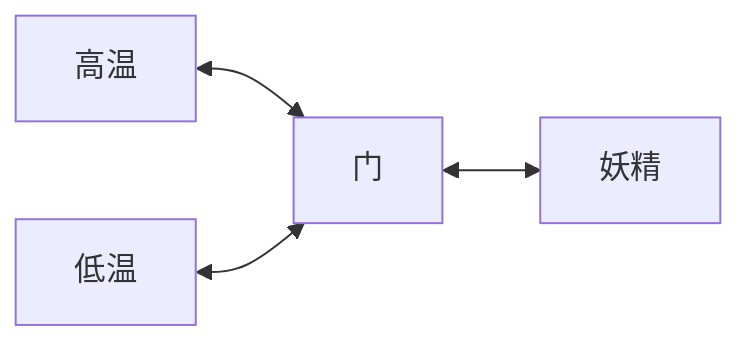
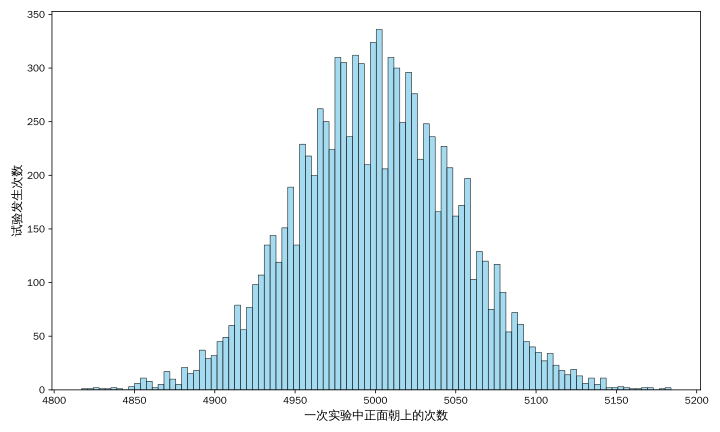
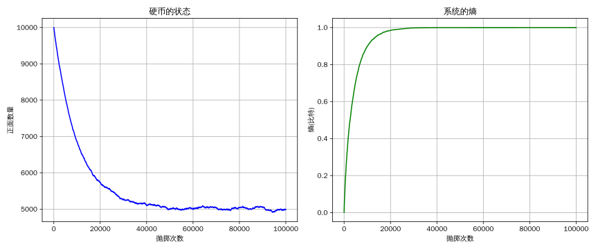

# 信息系统

- [信息系统](#信息系统)
  - [熵增定律](#熵增定律)
  - [麦克斯韦妖的死亡](#麦克斯韦妖的死亡)
  - [概率论](#概率论)
  - [信息论](#信息论)
  - [熵增原理](#熵增原理)
  - [总结](#总结)
  - [References](#references)

hello 大家好，这个视频距离上个视频经过了比较长的时间，上一个视频我们简单介绍了一下热力学第二定律这个众所周知的概念，然后说了一些与之相关的引申意义。简单一点总结就是：热力学第二定律描述了我们身处的物理世界是一个事情会自发变糟的世界。正所谓：

> 天地不仁，以万物为刍狗 ——《道德经》；

你可能会发出的质疑，你发现自己的世界好像也没有变糟啊？所以前面的结论也可能是不成立的。最后简单描述了麦克斯韦妖，这是一个很重要的概念，尽管是一个思想实验，但是看起来麦克斯韦妖可以让系统变得有序，不是一坨浆糊，也就推翻了热力学第二定律。尽管热力学第二定律看起来无懈可击，但总会有人试图攻击它，这个视频我们就来解释一下，热力学第二定律以及它的同义词熵增定律，以及为什么热力学第二定律是正确的。最后再叠个甲，这个视频中我会直接将人作为思想实验的对象，原则上来说可能会引发伦理问题，但是我觉得这些思考和我当然也和屏幕前的你息息相关，那我想也必然有人和我一样需要这些思考。

## 熵增定律

在热机能量转化的过程中，都有因为产生热而出现的能量耗散。对耗散问题更进一步的认识，主要是由德国物理学家克劳修斯完成的。克劳修斯了解到，耗散使得热和功之间产生了一个十分重要的不对称性。原则上，任何形式的功都可以被完全转化为热。但是耗散的存在意味着相反的说法不能成立，在热转化为功时，总有一部分热白白浪费掉了。也就是说热机做功的过程中热量损失是不可逆的，一旦发生热量损失，这种耗散掉的能量不可以再次变为功，于是我们可以推断所有的能量转化都是不可逆的，因为转化的过程一定伴随着耗散。这些耗散掉的热量我们可以想像为热机中分子无规则的随机运动。这种无规则运动的能量有一部分会被空气分子带走。最后的结果是作为热而出现的不可逆的能量耗散。

如果把人带入热机系统，我们也可以很容易的去验证，人体的温度是 36 ~ 37 度，而让人感受到舒服的室温，大约在 25 ~ 26 度，所以正常情况下人体总会向环境耗散热量，这些能量的耗散，从一定程度上反映了人体作为热机在不断地做功，很明显的是要让一个系统稳定运行，势必需要一个热机或者与热机类似功能的组件为系统提供能量。

克劳修斯在 1865 年引入熵(Entropy)的概念，用熵来表示热机做功过程中耗散掉的能量，熵的本意为转变或者演化，把可逆过程与不可逆过程加以区别。熵是这样一个量，它在有耗散的情况下不停地增长，当系统进一步做功的潜力耗尽时，它就达到了极大值。熵可以用来度量一个系统可变的能力。

> 孤立系统中，熵总是趋于增加，或者至少保持不变；

这是热力学第二定律的第三种表达方式，也叫做熵增定律。在一个孤立系统中自然发生的任何过程，都一定伴随着系统的熵增加。因而熵给所有孤立系统提供了一个时间箭头。当熵达到它的极大值时，孤立系统的时间演化或者转变就停止了，整个系统变成一坨浆糊，一般我们认为均匀是无序的状态，但有序和无序和人的定义有着很大的关系，这个我们后面再讨论。

玻尔兹曼提出了熵的统计解释，将宏观熵与微观状态数联系起来：

$$
S = k \ln W
$$

其中 $W$ 是系统的微观状态数，很显然系统的状态越多表示系统的熵越大。这一公式刻在玻尔兹曼的墓碑上，成为统计力学的核心思想。关于这一公式我们在后面在做解释，因为它和信息论有着很大的关系。

热力学第二定律是19世纪中期科学家的一个伟大成就，它标志着物理学基调的一种变化，牛顿力学里过去、现在、未来的任何时刻都是一样的，因此，力学没有时间性。但是热力学第二定律使得他们知道了那些事情不能做。热力学第二定律描述了时间是有方向的，简单讲就是一般情况下我们可以判断视频是不是倒放的。

## 麦克斯韦妖的死亡

上一个视频我们说了麦克斯韦妖似乎可以做到逆转热量的损失。一个绝热容器被分成相等的两格，中间是由 妖 控制的一扇小门，容器中的空气分子作无规则热运动时会向门上撞击，妖控制门可以选择性的将速度较快的分子放入一格，而较慢的分子放入另一格，这样，其中的一格就会比另外一格温度高，可以利用此温差，驱动热机做功，这样我们就完成了减熵的操作，推翻了热力学第二定律。



为了解决麦克斯韦妖妖带来的问题，利奥·西拉德，在 1929 年对麦克斯韦妖进行了深入研究，认识到妖精最重要的是需要决定空气分子应该放在盒子的哪一边。而为了知道分子的速度，妖精需要通过**测量**分子的速度来获取信息，而这一测量过程需要消耗能量。这种能量消耗会导致系统的总熵增加，从而抵消了妖精减熵的效果。

1951 年，物理学家布里卢安提出为了获取分子的信息（例如其速度或位置），麦克斯韦妖必须与环境发生交互，例如通过测量分子发射或吸收光子。这种测量过程需要消耗能量，并导致系统的总熵增加；

1961年，物理学家罗尔夫·兰道尔(Rolf Landauer)提出了一个革命性的理论，被称为兰道尔原理(Landauer's Principle)，兰道尔原理指出：擦除 1 比特的信息至少需要消耗 $kT\ln 2$ 的能量，其中 $k$ 是玻尔兹曼常数，$T$ 是系统的绝对温度，这是能量的理论下限，实际的擦除过程中，需要更多的能量。擦除，就是计算机存储中耗费能量的行为。

1982 年，贝内特证明，为了减少容器中的熵，妖魔总是得付出代价。麦克斯韦妖本质上是一台信息处理器，该机器必须测量原子的速度，在记忆体中写入比特以记录测量的结果，然后用该比特执行程序，来打开或者关闭门决定分子是否通过。写入比特的操作隐含了擦除的行为，意思是机器的存储空间是有限的，当所有空间都写满后，总需要擦除的操作来记录新的比特。所以麦克斯韦妖必须擦除其存储的信息，而这一擦除过程必然消耗能量，从而恢复热力学第二定律的正确性，麦克斯韦妖就此结束了它的一生。

尽管麦克斯韦妖的问题被解决了，但我们确实可以通过以增加系统总熵的方式来维持系统中某个子系统的低熵状态，并且我们确实是这么做的。维持系统的低熵状态是我们希望完成的事情，而现在我们应该知道，孤立系统的熵增是自发的，但好在我们身处的这个世界不是孤立系统，所以我们不会坐以待毙，可以从外界获取能量和信息为系统减熵。为使系统保持一种低熵的状态，能够用来减熵的原料我们称之为负熵，一般而言就是能量和信息。而努力减熵的你我，就是一个个活生生的麦克斯韦妖。

为了更进一步的解释熵增定律，我们首先来了解或者说复习一下概率论的一些基础概念。

## 概率论

假设某次试验的结果是不确定的，但是所有可能的结果的集合我们是知道的，那么这里就称这个集合为**样本空间**；样本空间的任意子集称为**事件**；比如抛掷一枚骰子，朝上的点数可能是：$\{1, 2, \cdots, 5, 6\}$，那这里样本空间就是 $S=\{1, 2, \cdots, 5, 6\}$，而事件是我们人为定义的，比如正面是 1 是一个事件，这个事件的概率很朴素，是 $1 \over 6$，再比如正面是奇数，这也是一个事件，概率是 $1 \over 2$。虽然说很朴素，但是凭什么前一个事件的概率是 $1 \over 6$ 而后一个事件的概率是 $1 \over 2$？

你可能会回答，前一个事件样本空间可以划分为 $\{\{1\}, \{2\}, \{3\}, \{4\}, \{5\}, \{6\}\}$ 这些事件是等可能发生的，所以概率是 $1 \over 6$，后一个事件样本空间可以划分为 $\{\{1, 3, 5\}, \{2, 4, 6\}\}$ 这些事件也是等可能发生的，所以概率是 $1 \over 2$。假设这个推理是正确的，那么我们凭什么说这些事件都是等可能的？或者说我们凭什么假设事件是等可能发生的？这是由于：

> 等可能意味着我们对事实一无所知！

理由很简单，就是我们不知道事件发生的概率，所以只好假设样本空间中的事件都是等可能的，这里的等可能依赖于我们的无知，举个简单的例子，随便一枚确定的硬币，正面向上的概率是 $1 \over 2$ 的概率是 $0$，也就是对于确定的硬币，我们知道它正面向上的概率大概率在 $1 \over 2$ 左右，但是由于硬币质地做功等的问题，正面和反面是不一致的，所以我们可以推断它的概率大概率不是 $1 \over 2$，但是由于我们的无知，也只好假设概率是 $1 \over 2$。等可能是基于我们的无知，那么假设如果我们知道一点点信息情况会发生什么变化？

一个经典例子是：一对夫妻生了两个孩子，已知其中一个是男孩，那么另一个是女孩的概率是？。

首先生两个孩子的样本空间是：

- 男男
- 男女
- 女男
- 女女

由于我们的无知，所以他们发生的概率都是 $1 \over 4$，然后我们得到了一点点信息，其中一个是男孩，那么情况就发生了变化，样本空间就变成了：

- 男男
- 男女
- 女男

所以，另一个是女孩的概率是 $2 \over 3$。

另一个经典里例子是三门问题，源自电视节目《Let's Make a Deal》中的游戏环节。游戏有三扇门，一扇门后是汽车，另外两扇门后是山羊。参与者选择一扇门，之后主持人会**打开剩下两扇门中的一扇山羊门**。主持人不会打开参与者选择的门或有汽车的门。问题是：参与者在该不该在主持人打开山羊门后，改变主意换成另一扇未打开的门？

参与者首次选择时，一开始选中汽车的概率为 $1 \over 3$，选中山羊的概率为 $2 \over 3$，主持人行动的影响导致：

- 若参与者首次选中山羊，主持人必然打开另一扇山羊门，此时剩下的未开门的门后是汽车；
- 若参与者首次选中汽车：主持人随机打开一山羊门，剩下的门也为山羊；

所以换门时中奖的概率是 $2 \over 3$。

这里三门问题比较临界可能不好思考，不如把门设定为 1000 个，首先参与者随机选择一个门，然后主持人开掉了剩余 998 个没有中奖的门，请问你现在愿不愿意换到剩下的那个门呢？

当然除了直接的理论推导以外，我们还有更加朴素的方法来证明三门问题，那就是蒙特卡洛法，方法很简单，就是我们进行多次重复试验，然后通过统计信息来估计概率。**当试验次数趋于无穷大时，估计的概率趋于真实的概率，这个就是大数定律。** 通过简单的模拟我们可以看到交换之后的中奖概率就是 $2 \over 3$。

```python
import random

# 记录保持原来选择和切换选择的获胜次数
num_simulations = 100000
stay_wins = 0
switch_wins = 0

for _ in range(num_simulations):
    # 随机设置奖品的位置（0, 1, 2）
    prize_door = random.randint(0, 2)
    # 参与者随机选择一扇门
    player_choice = random.randint(0, 2)

    # 主持人打开一扇门，展示山羊
    # 主持人不能打开有奖品的门，也不能打开玩家选择的门
    # 可选择的门是从剩下的两扇门中排除有奖品的门
    doors = [0, 1, 2]
    doors.remove(prize_door)
    if player_choice in doors:
        doors.remove(player_choice)
    # 主持人随机选择一扇门打开
    opened_door = random.choice(doors)

    # 切换选择的门
    # 从剩下的两扇门中排除打开的和玩家原来的选择
    doors = [0, 1, 2]
    doors.remove(opened_door)
    doors.remove(player_choice)
    switch_choice = doors[0]

    # 判断是否获胜
    if player_choice == prize_door:
        stay_wins += 1
    if switch_choice == prize_door:
        switch_wins += 1

# 输出结果
print(f"模拟次数: {num_simulations}")
print(f"保持选择获胜的次数: {stay_wins}, 胜率: {stay_wins / num_simulations:.2%}")
print(f"切换选择获胜的次数: {switch_wins}, 胜率: {switch_wins / num_simulations:.2%}")
```

```text
模拟次数: 100000
保持选择获胜的次数: 33287, 胜率: 33.29%
切换选择获胜的次数: 66713, 胜率: 66.71%
```

这是两个条件概率的典型例子，条件概率是指在已知某一事件发生的条件下，另一事件发生的概率。其数学定义如下：设 $A$ 和 $B$ 是两个事件，且 $P(B)>0$，则在事件 $B$ 发生的条件下，事件 $A$ 发生的条件概率 $P(A|B)$ 定义为：

$$
P(A|B) = {P(AB) \over P(B)}
$$

这里条件概率的定义和计算不重要，重要的是：

> 信息可以改变人们对事件的判断！

而且，很多时候我们其实不需要确切的计算出概率的值，而只需要知道不同事件发生概率的大小，能够帮助我们做决策就可以。如前所述，麦克斯韦妖可以通过信息进行减熵，和这里的决策过程如出一辙。

现实世界中随机性所处可见，当同一个随机事件(随机变量)发生很多次之后，它们和的分布会趋于正态分布，这称之为中心极限定理。比如抛硬币这个随机事件，在不知道硬币的质地之前我们只好假设正面向上和反面向上的概率都是 $1 \over 2$，那么做很多次抛硬币试验，比如 10000 次，那么对于正面向上的次数的统计近似服从正态分布。我们可以用 Python 来画一下试验的图像。可以看到每次实验大概都是可以拟合成为钟形曲线。



正态分布是最重要的一个分布，基本上如果你对事实一无所知，并且事情又很频繁发生的话那么你最好认为事件服从正态分布，事实上一无所知的情况下，好像也没什么可选。一种情况是选择均匀分布，如前所述实际上如果事件不是大规模发生的话，我们认为是均匀分布也没什么不妥。当分布律是离散的，并且大规模发生的时候，这时候可以认为是泊松分布，再不然可以直接认为服从正态分布。这和均匀分布有了本质的区别，因为分布不再是等可能的了，意味着我们多少知道了一点信息，虽然不多，比如我们可以很明确的确定，只要硬币没有大问题，连续抛 10000 次正面向上是不会发生的。但是理论上这件事情还是可以发生的。就是这件事可能会发生，但是这件事发生不太可能。当然这和我们的分类有着很大的关系，虽然我们知道正面向上的次数大概率会在 5000 次左右，但是 连续正面向上 5000 次，然后反面向上 5000 次的概率，应该和连续 10000 次正面向上的概率是一样的。不过正面向上 5000次，构成这种事件的样本元素太多了，于是构成了一种不均匀。

> 独立随机变量之和的分布在一定条件下趋近于正态分布，这被称为中心极限定理

这一定理成立的条件是，分布需要具有期望和方差，我不打算详细介绍期望和方差，但是一般情况下你可以认为平均数就是期望，取值的波动幅度就是方差。正常情况下随机变量的期望和方差都是存在的，所以我们认为随机变量的和在规模比较大的时候服从正态分布其实是一个比较不错的选择。至少要比均匀分布好一点。

你可能会考虑什么情况下期望和方差不存在呢？假如我们要统计房间里人的工资水平，突然雷布斯（任何一个特别有钱的人）进入了房间，这个人进入房间前和进入房间后，统计的分布发生了翻天覆地的变化，一般我们称这种事件为黑天鹅事件，是我们很难预知的。存在这种事件的分布，期望和方差就不存在。不过正常情况下我们认为这种事件是极小概率的，可以忽略。另外，人财富的分布一般认为是幂律分布，也就是人们常说的二八定律：20% 的人掌握着社会 80% 的财富，朴素的我们此时应该能够想到正态分布，特别富有的人是特别少的，但不同的是，幂律分布告诉我们特别穷的人，诸如屏幕前的你我，是特别多的。

## 信息论

对于麦克斯韦妖问题，信息论提供了一个与热力学定律稍微不同的看法。如以充满气体的盒子为例，用热力学语言说，我们可以用能量来把热的分子和冷的分子分开，以减少盒子的熵，使盒子的一边热而另一边冷。但是，能量的供应停止后，盒子将渐渐回到平衡状态。在系统达到平衡后，熵达到极大值。

而用信息语言，我们重新描述一下这一状态的变化，这种交换看起来有一些细微的不同。起初，盒子处在平衡状态。我们可以通过测量来收集并处理盒子中分子的信息，这种处理方式改变了存储在盒子中的信息。布里卢安发现，麦克斯韦妖通过测量把信息转移到容器，将热的分子和冷的分子分开。然而一旦能量停止供应，这些存储的信息就会泄露到环境中，因为自然界好像要使储存的信息耗散，正如它要使熵增加一样。这两种描述的结果完全相同。

前面关于条件概率的讨论可以很明显让你感到信息对决策的帮助，信息可以让本来是一坨浆糊的均匀分布，变得不那么均匀。那么什么是信息呢？根据香农在《通信的数学原理》中对信息的描述，信息是可以消除不确定性的东西。比特这个词第一次在该论文中出现，回答一个是否的问题，需要 1 比特的信息。

香农熵是信息论的核心概念，用于量化信息的不确定性或随机性。对于一个离散随机变量 $X$，对应的概率分布为 $P(X=x_i)=p_i$，香农熵 $H(X)$ 定义为：

$$
H(X) = - \sum_{i = 1}^n p_i \log p_i
$$

一开始信息使得香农困惑，所以他决定起名为不确定性，不过在和冯诺依曼讨论过后，冯诺依曼认为应该把它叫做熵，原因有两个，首先不确定性函数已经在统计力学中以熵这个名称使用了，所以它已经有了一个名字。第二，也是更重要的，没有人知道熵到底是什么，这样可以在讨论中占据优势。

熵衡量的是：消除不确定性所需的信息量。熵越高，系统的不确定性越大。香农熵从形式上与玻尔兹曼熵非常的相似，如果系统中所有状态的概率都是等可能的，那么香农熵就和玻尔兹曼熵完全一致。如果系统的状态数为 $W$，由于等可能于是概率 $p = {1 \over W}$ 于是 $H(X) = -n{1 \over W}\log {1 \over W} = {n \over W} \log W = k \ln W$。所以玻尔兹曼熵是香农熵的一个特例。

熵是信息的对立面，如果信息是我们知道的，那么熵就是我们不知道的，未知意味着不确定性，不过很多时候用熵来衡量信息量，也就是如果我们将不知道变成知道需要多少信息。

## 熵增原理

从信息论的角度再来看热力学第二定律，如果我们把孤立系统视为一个马尔可夫链，其中状态转移规律由改系统的物理定律控制。理论上可以知道相对熵总是减少。随着时间的推移系统分布会趋向于每一个平稳分布，如果平稳分布是均匀分布，则熵增加。这是信息论对热力学第二定律的解释，也意味着，它完全独立于确切的物理系统，只针对于概率分布。称之为**熵增原理**，也意味着热力学是信息论的一个特例，而且看起来也只有这一个特例，热力学第二定律和熵增原理描述的是同一件事的不同侧面。

通俗的说，由于我们的无知，我们只好认为系统的概率分布是均匀分布，如果是均匀分布，那么系统在一段时间后一定会在状态做多的那种状态中，比如前面的抛硬币试验，我们知道在 10000 次实验中，正面向上的次数很可能在 5000 次左右，但是确切的连续正面向上5000次，然后反面向上 5000 次似乎是不太可能的。假设现在有 10000 枚硬币，全部正面向上，这种状态只有一种，所以完全确定，熵为 $0 = \log 1$，现在从中随机取出一枚抛一下，这里 10000 枚每一枚都是不同的，那么此时可能的状态马上会多出 $C_{10000}^1 = 10000$ 种，只是主观上，我们认为这 10000 种都一样，这个过程就是熵增的具体表现。随着我们持续地抛硬币，这 10000 枚硬币的状态会趋向于 5000 枚正面向上和 5000 枚反面向上。至此状态数量达到最大值，整个硬币的分布就成了一坨浆糊。这个过程我们同样可以用 Python 来模拟一下，可以看到随着不断地抛掷，正面向上的数量会逐渐向 5000 靠拢，系统的熵也逐渐的增大。



熵增原理依赖于人的分类，每一种状态对于物理世界都是一样的。而物以稀为贵，人喜欢的东西大概率是稀缺的，所以正常情况下事情大概率会向着不稀缺的方向发展。但是我们错误的以为好的和坏的似乎是一样多的，这是一个关键的错误，回顾上面正态分布的图形，我们应该理解好的事情是很少的，而坏的事情也是很少的，大多数的事情实际上都是平凡朴素的，而平凡的和坏的我们统称为不好的。所以尽管天上可能会掉馅饼，但是你最好不要相信天上会掉馅饼。如果有人告诉你天上在掉馅饼，那么这就违反了熵增原理，很大可能意味着他是个骗子。而且即便是你遇到了掉馅饼的事情，也不应该掉以轻心，因为确实可以短暂的违反熵增原理，只是命运馈赠的礼物，早已在暗中标好了价格。这里更多的细节我们留到下个视频再来解释。

这也很容易解释房间会自发的变乱，是由于房间是乱的这种状态要比房间是整洁的状态多得多。热水变冷和冰雪融化，这两件事似乎都指向同一种状态，但是由于稀缺性以及人的喜好，热水和冰雪都是一种低熵的状态。前面只说了人面桃花相映红，却忽略了去年今日此门中，也完美的复合熵增原理的描述，随着时间的推移，人面不知何处去。

这里还有一个相当重要的角度是，熵增像热量的转移一样是不以人的意志为转移的，只要是不平衡的物质，都具有熵增的倾向。但是由于存在各种麦克斯韦妖为系统减熵，所以事情的发展我们可以分为两个部分，第一部分是系统熵增的过程，这部分很无趣，系统最后变得混乱；第二部分是麦克斯韦妖为系统减熵的过程，经过麦克斯韦妖观测系统的状态，并采取一些措施，付出一些代价，系统最后重新恢复秩序。就比如假如正常情况下一开始房间无论多整洁，一段时间后，房间里总会落一些灰尘。然后我们观测房间的状态，对其进行打扫，房间重新变得整洁。不过变得整洁的这个过程，也一定会产生很多垃圾，增加环境的总熵。这个过程中只要时时勤拂拭，勿使惹尘埃看起来好像可以一直维持房间整洁，但是，人和房间都会随着时间的推移变得衰老、陈旧，系统中总是会有一些熵增，构成我们回答不了的问题。

站在信息的角度来思考熵增，时间向前走，历史不断产生，产生了很多我们不知道的事实，这些未知的不确定性可以用 熵 来描述。所以熵增可以认为是一个错误逐渐积累的过程，这些错误会在未来的某个时刻变成生活中的问题，需要我们去回答。

由热力学第一定律和热力学第二定律，我们应该知道，系统要想跑起来，就需要一个热机或者类似于热机的引擎驱动，所以一定需要能量。而且由熵增原理，我们还应该知道，只有能量是不够的，我们还需要信息。很多情况下，人可以视为一台信息处理的机器，我们通过感官获取信息，通过神经系统处理信息，通过肢体输出信息。

这里的主要思路出自薛定谔著名的小册子《生命是什么》，其中还有一些细节，比如著名的：**生命以负熵为生**。我们到下一个视频再做描述，感兴趣的话可以看一下。

## 总结

我们这个门派公认的祖师爷是克劳德·香农，一般认为是他创立了信息论。但是也是一个极其松散的门派，可以看到很多人如克劳修斯、麦克斯韦、玻尔兹曼、薛定谔、西拉德等都为此做出了贡献，因为香农本人并不认同其中的很多观点，他认为把熵增原理无差别的推广是不严谨的，但是下一个视频就要做无差别的推广。所以香农实际上成了一个类似于量子力学一样的背锅侠。

当瓦特蒸汽机的飞轮转动工业革命时，人类第一次系统性地将热能转化为有序动能；而当图灵机在纸带上写下第一个符号，一场更深刻的革命已悄然降临——信息系统的本质，是在热力学第二定律的熵增铁幕下，用比特构筑对抗混乱的巴别塔。这个视频中人只是作为系统，而能量和信息作为负熵，但是对于整个社会来说，人很多时候也扮演着负熵的角色，这个我们下次再说。

## References

- [奥] 埃尔温·薛定谔 - 生命是什么
- [美] 塞费 - 解码宇宙
- [美] 詹姆斯·格雷克 - 信息简史
- [英] 彼得·柯文尼 & 罗杰·海菲尔德 - 时间之箭
- [美] Thomas M. Cove - 信息论基础
